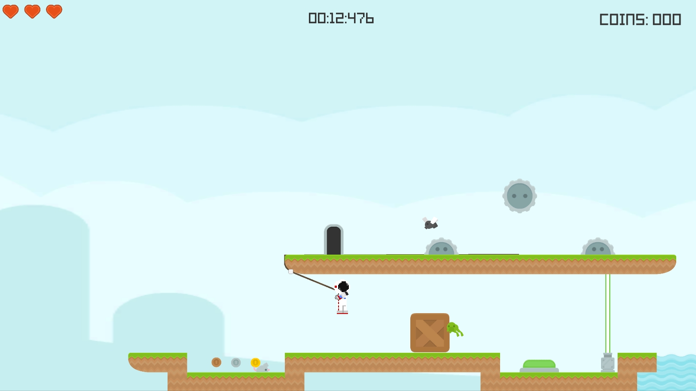
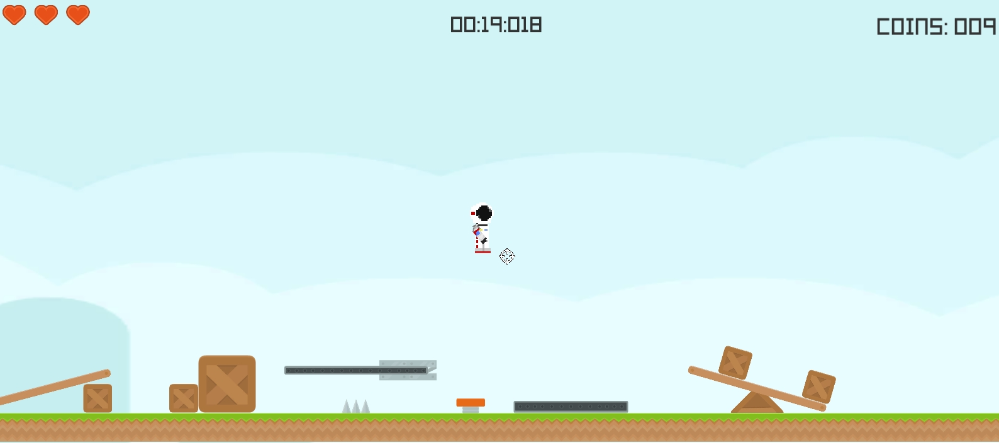
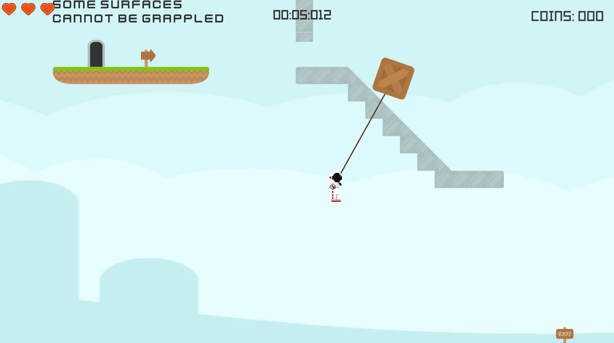
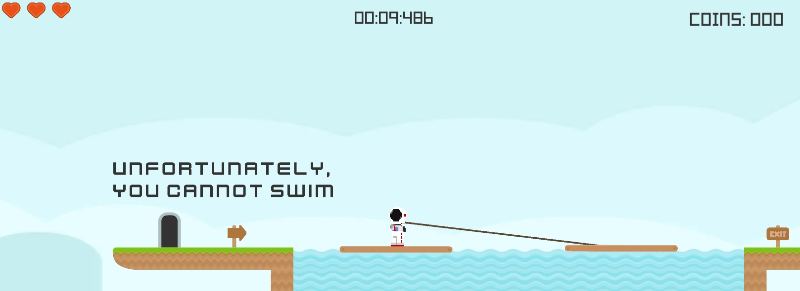

# GrappleHookPlatformer
A 2D Puzzle Platformer based around usage of a grapple hook

## Features
* Custom Platformer 2D controller
* Grapple rope wrapping around objects
* Numerous physics based items using Unity 2D Physics (chains, blocks, levers, springs)
* Puzzles (buttons, switches, lazers, conveyer belts)
* Enemies (turrets, tracking AI, patrol AI)
* Environments (snow , water, grass)

## Sample Screenshots

